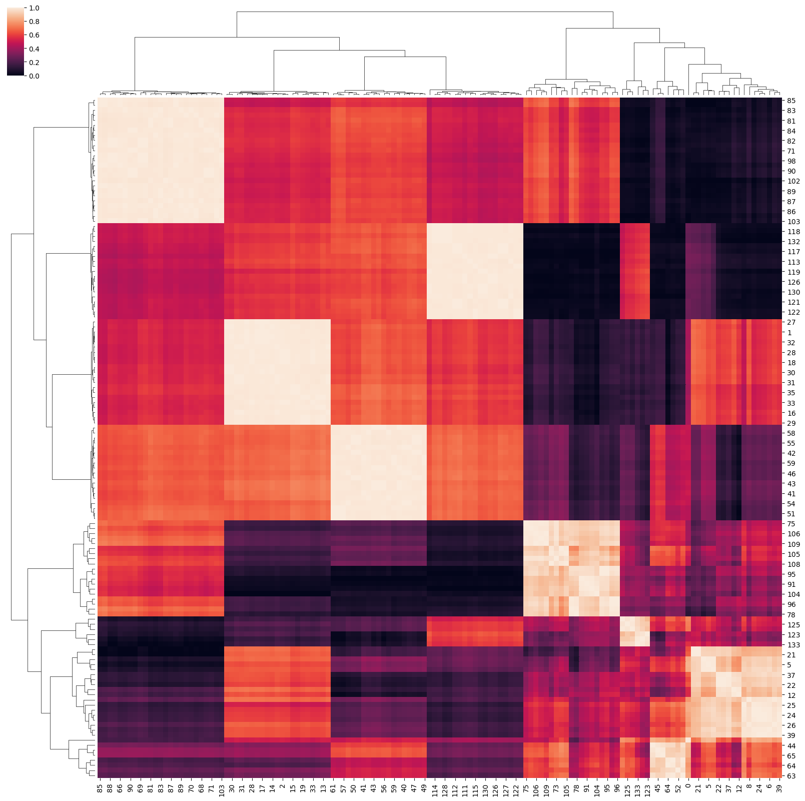

# Tensor Product Representation Recurrent Neural Network
This repository containes PyTorch implementation of
paper [*Learning to Reason with Third-Order Tensor Products*](https://papers.nips.cc/paper/8203-learning-to-reason-with-third-order-tensor-products)
published at NeurIPS, 2018.
TPR-RNN is applied to the bAbI tasks and achieves SOTA results.
This implementation is primarily based on the [*original
implementation*](https://github.com/ischlag/TPR-RNN).

# Requirements
- Python 3.6
- Pytorch==1.0.0
- tensorboardX==1.5

## How to setup environment
1. [Download and install conda](https://conda.io/docs/user-guide/install/download.html)
2. Create conda environment from environment.yml file
```
conda env create -n tpr_rnn -f environment.yml
```
3. Activate conda environment
```
source activate tpr_rnn
```

# Usage
Run the pre-trained model.
```bash
python3 eval.py --model-dir PATH [--no-cuda]
```

Train from scratch. (Look at the train.py files for details)
```bash
python3 train.py --config-file PATH --serialization-path PATH
[--eval-test] [--logging-level LEVEL]
```

Cluster analysis
```bash
python3 cluster_analysis.py --model-path PATH [--num-stories N]
```

## Cluster Analysis
Results of cluster analysis on random stories related to task 3.





## Evaluation results
For each task model was trained, here are test data evaluation
results. Robust hyper-parameter search wasn't done and Adam is being
used instead of NAdam from original implementation but results 
are quite similar to results obtained in the original paper.

|  Task |  1  |  2  |  3  |  4  |  5  |  6  |  7  |  8  |  9  |  10 |  11 |  12 |  13 |  14 |  15 |  16 |  17 |  18 |  19 |  20 |
|:-----:|:---:|:---:|:---:|:---:|:---:|:---:|:---:|:---:|:---:|:---:|:---:|:---:|:---:|:---:|:---:|:---:|:---:|:---:|:---:|:---:|
| Error | 0.0 | 0.1 | 1.1 | 0.0 | 0.3 | 2.5 | 0.4 | 0.4 | 2.2 | 0.1 | 0.3 | 0.2 | 1.6 | 0.4 | 0.0 | 0.0 | 3.9 | 2.3 | 0.2 | 0.0 |

## Pre-trained models
Pre-trained models are store at [google drive](https://drive.google.com/drive/folders/1mMTUlCHhHnxPwD36_Al4sq6KiESI4taN?usp=sharing).
